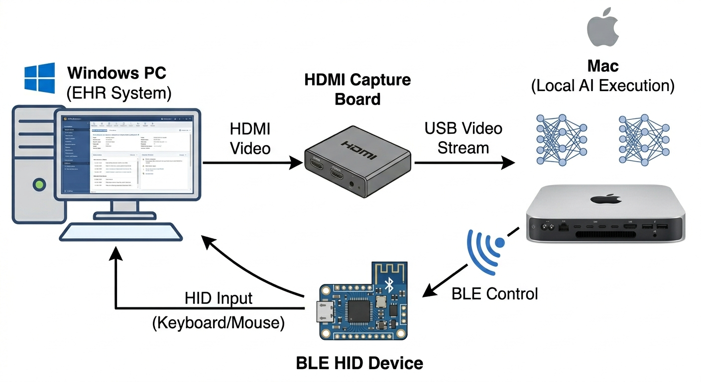

# EHR Agentic Toolkit

> 📢 **Notice for Judges:**
> The `main` branch reflects the exact state of the project at the hackathon submission deadline. All ongoing development and post-hackathon improvements are conducted in the `dev` (or other) branch.



**AI-powered clinical documentation automation toolkit for Electronic Health Record systems.**

EHR Agentic Toolkit connects your existing EHR system with AI capabilities without requiring direct system integration. Whether your EHR is on-premises or browser-based, the toolkit uses screen capture and OCR technology to extract clinical information and automate clinical documentation generation.

**Current capabilities:**
- Automated creation of medical referral letters (診療情報提供書)
- Automated discharge summary generation (退院時サマリ)
- AI-assisted text input via IME conversion for existing EHR fields

**Future roadmap:**
- Differential diagnosis assistance (鑑別診断支援)
- Treatment suggestion support
- Broader clinical decision support features

## Components

| Component | Description | Location |
|---|---|---|
| **Hardware Agent** | Python automation pipeline for on-premises EHR: HDMI capture, OCR, AI-assisted text input, discharge summary generation | [`hardware-agent/`](hardware-agent/README.md) |
| **EHR-Agent (Swift)** | macOS native AI chat application with screen capture and debugging for browser-based EHR access | [`swift-appkit/`](swift-appkit/README.md) |

## Setup

Clone the repository with submodules:

```bash
git clone --recurse-submodules <repo-url>
```

If you already cloned without `--recurse-submodules`, populate submodules in place from the project root:

```bash
git submodule update --init --recursive
```

## Hardware Requirements

### For AI Model (Gemma 4 26B 4-bit)

This project requires running **Gemma 4 26B with 4-bit quantization** for AI text generation. This model runs locally via **omlx** or **ollama**.

**Minimum requirements:**
- Apple Silicon Mac with **M4 chip or later**
- **24GB RAM or more**
- Runs via [omlx](https://github.com/jundot/omlx) or [ollama](https://github.com/ollama/ollama)

### For Keyboard/Mouse Control (ESP32-S3)

To control Windows applications via BLE keyboard/mouse emulation, you need to flash the **ESP32-S3** device with the `wireless-input-bridge.ino` firmware.

**Required hardware:**
- ESP32-S3 device (e.g., M5AtomS3U, or any ESP32-S3 development board)
- USB-C cable for programming

See [`hardware-agent/wireless-input-bridge/`](hardware-agent/wireless-input-bridge/) for flashing instructions.

## License

This project is licensed under the Apache License 2.0 - see the [LICENSE](LICENSE) file for details.

## Disclaimer

This software is provided for research and development purposes. It is not a medical device and should not be used as the sole basis for clinical decisions. Always verify AI-generated suggestions with clinical judgment and current medical guidelines.

## Acknowledgments

- Built with [Anthropic Claude](https://www.anthropic.com/claude)
- OCR powered by [EasyOCR](https://github.com/JaidedAI/EasyOCR)
- BLE communication using [Bleak](https://github.com/hbldh/bleak)
- Computer vision using [OpenCV](https://opencv.org/)
